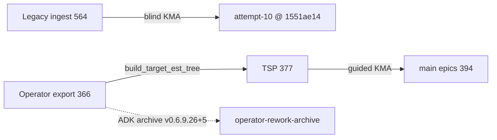

# Blind KMA candidate vs operator-reworked tree (attempt 10)

Compares the **intended blind ingest token surface** (A) to the **operator rationalised export** (B). This is **not** the attempt-11 guided-KMA vs TSP score (93.99%) — see [THREE-WAY-STRUCTURAL-DIFF.md](../../attempt-11/feedback-package/THREE-WAY-STRUCTURAL-DIFF.md).

## Artifacts

| Side | File | Unique `E:S:T` |
|------|------|---------------:|
| **A — KMA candidate** | [KMA-CANDIDATE-EST-TREE.md](KMA-CANDIDATE-EST-TREE.md) | 564 |
| **B — Operator reworked** | [OPERATOR-REWORKED-EST-TREE.md](OPERATOR-REWORKED-EST-TREE.md) | 366 |

## Why raw `E:S:T` set diff is not meaningful

Side **A** lists **legacy game epic IDs** (`E01` = Galaxy Navigation, `E10` = UAT, …) from the read-only archive. Side **B** lists the **operator v4 rationalised band** (`E01` = repo infra, game work under `E30+`, UAT absorbed into domain). The same work item therefore appears under different epic numbers — **A ∩ B = 0 on literal tokens is expected**, not evidence of total disjoint content.

Compare structurally via:

1. [migration-proposal.md epic map](../feedback-package/migration-proposal.md#epic-map) (legacy → v4 homes)
2. Attempt-10 pass-2 filesystem tweaks ([FB §4](../feedback-package/FB-ADK-KMA-KANBAN-MIGRATION.md#4-operator-tweaks-log))
3. Attempt-11 TSP / guided score vs operator target ([THREE-WAY](../../attempt-11/feedback-package/THREE-WAY-STRUCTURAL-DIFF.md)) — separate programme

### Inventory counts

| Metric | A (legacy ingest) | B (operator export) |
|--------|------------------:|--------------------:|
| Unique `E:S:T` | 564 | 366 |
| Legacy / operator epics in file | 19 game + infra | 19 v4 bands (E01–E09 core + E30–E40 domain) |
| Stories (filesystem) | 68 legacy | 105 operator sections |

### Epic band mix (literal IDs — different namespaces)

| Band | A (legacy IDs) | B (v4 IDs) |
|------|---------------:|-----------:|
| CORE (E01–E08) | 33 | 104 |
| ANCILLARY (E09–E22) | 531 | 0 |
| DOMAIN (E30–E45) | 0 | 262 |

### Legacy → v4 epic map (from blind proposal)

| Legacy | v4 target(s) |
|--------|----------------|
| E01 Galaxy | **E30** |
| E02, E05 Ships | **E31** (operator pass-2 merged E02+E05 body) |
| E03 Testing/Docs | **E05**, **E07** |
| E15 Infra | **E01–E06** (pass-2 split routing) |
| E10 UAT | **E40** (TSP later → **E41**) |
| E16 Backlog | **E45** |
| … | Full table in [migration-proposal](../feedback-package/migration-proposal.md#epic-map) |

## Operator pass-2 tweaks (filesystem, not in B export)

Attempt-10 pass-2 agentic fixes on blind synthesised `docs/kanban/` — see [FB-ADK-KMA-KANBAN-MIGRATION.md §4](../feedback-package/FB-ADK-KMA-KANBAN-MIGRATION.md#4-operator-tweaks-log):

1. E15 stories routed across E01/E02/E03/E05/E06/E33 (not all E02)
2. `story-NN-legacy-*` naming to resolve template collisions (UXR-017)
3. E31 epic synthesised from E02+E05 merge
4. Domain epic titles renumbered E30+

Package freeze: SBL `dev` @ `1551ae14` ([#57](https://github.com/RMS-Ltd/ai-dev-kit/issues/57)). Installed-state `docs/kanban/` was **not** mirrored to ADK ([#85](https://github.com/RMS-Ltd/ai-dev-kit/issues/85)).

## GitHub issue archaeology

| Issue | What it holds | What it does **not** hold |
|-------|---------------|---------------------------|
| [#52](https://github.com/RMS-Ltd/ai-dev-kit/issues/52) (attempt 09, closed) | Maintainer triage; links SBL `KMA-REFERENCE-EST-TREE-ATTEMPT-09.md` | Operator titled export |
| [#57](https://github.com/RMS-Ltd/ai-dev-kit/issues/57) (attempt 10, closed) | Final sign-off; blind KMA FB; freeze SHA `1551ae14` | `temp/sbl-operator-kanban-est-tree-titled.md` |
| [#51](https://github.com/RMS-Ltd/ai-dev-kit/issues/51) (attempt 08, closed) | Operator `TARGET-ES-TREE-E30-RATIONALISED` narrative | EST tree file attachment |

**Recovery source for B:** local SBL checkout `temp/` (gitignored) — now mirrored at [OPERATOR-REWORKED-EST-TREE.md](OPERATOR-REWORKED-EST-TREE.md) (ADK) and `docs/kanban/reference/OPERATOR-REWORKED-EST-TREE.md` (SBL `main`).

---

## SBL `main` @ `a363f5c9` (2026-06-24)

Starborn Legacy pushed programme carry to [`main`](https://github.com/RMS-Ltd/starborn-legacy/tree/main). This is **not** the attempt-10 installed `dev` snapshot (`1551ae14`); it is the attempt-11 **guided KMA + TSP** line merged from execution base `pre-adk-install` (`eb5f3f52` → mirror commits).

### What landed on `main`

| Surface | Present? | Detail |
|---------|:--------:|--------|
| `docs/adk-feedback/attempt-11/` | ✅ | `package_status: final`; [#85](https://github.com/RMS-Ltd/ai-dev-kit/issues/85) intake |
| `docs/adk-feedback/attempt-09\|10/` | ❌ | ADK mirror only — [`adk-install-into-sbl/`](../../) |
| `docs/kanban/reference/` (TSP pack) | ✅ | TSP, remap YAML, rubric, `tools/kanban/*` |
| `docs/kanban/epics/` | ✅ | 20 epic folders · 157 story/task markdown files |
| `temp/sbl-operator-kanban-est-tree-titled.md` | ❌ | Gitignored — fix in [SBL PR #2](https://github.com/RMS-Ltd/starborn-legacy/pull/2) |
| `docs/kanban/archive/legacy-kma-ingest/` | ❌ | Pass-1 blind archive never committed |
| `tools/workflow_mgt/` | ✅ | Symlinks to vendor ADK |
| `.adk/release-state.db` | ✅ | SQLite release authority |

### Token sets on `main` (harvested 2026-06-24)

| Source | Unique `E:S:T` | Notes |
|--------|---------------:|-------|
| TSP (`TARGET-EST-TREE.md`) | **377** | Canonical guided target |
| Active `docs/kanban/epics/` | **394** | Includes 17 bootstrap/perpetual tokens beyond TSP |
| TSP ∩ `epics/` | **377** | **100%** TSP task coverage in active tree (improved vs prep-phase THREE-WAY ~51%) |
| `repo − TSP` | **17** | `E02:S02:T03–T07`, `E02:S16:T01–T06`, scattered core scaffold |
| Side **B** (this archive) | **366** | Pre-TSP operator export |
| TSP − **B** | **11** | `E36:S06:T01–T11` body-inject rule only |

### Structural score on `main`

From [`KMA-SCORE-LATEST.json`](https://github.com/RMS-Ltd/starborn-legacy/blob/main/docs/kanban/reference/KMA-SCORE-LATEST.json) on SBL `main`:

| Metric | Value |
|--------|------:|
| Weighted total | **93.99%** ✅ (guided threshold 85%) |
| unique_task_coverage | 100% |
| epic_band_parity | 78.29% |
| title_coverage | 88.86% |
| Open folder issue | missing `epic-45` (backlog band) |

`REPO-ALIGNMENT.md` on SBL still says “~192/377” in active tree — **stale**; live harvest matches score JSON (377/377 TSP tokens in `epics/`).

### Lineage (three programmes)

- **This document (A vs B):** blind ingest surface vs operator rationalised export — compare via epic map, not literal token intersection.
- **SBL `main` (D vs E):** guided KMA outcome vs TSP — scored at 93.99%; use for attempt-11 closure, not attempt-10 blind replay.
- **BR-112 / T40 verification:** replay orchestrator against ADK pin `v0.4.1224+1`; do **not** treat SBL `main` as attempt-10 replay target.
