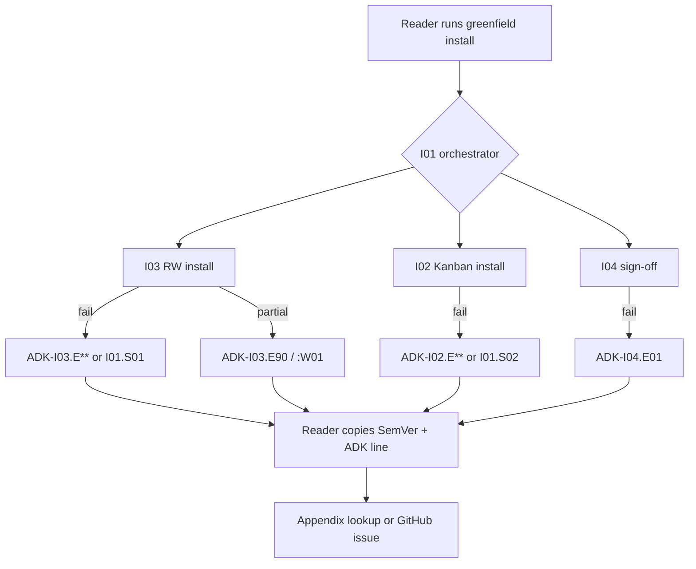

# Install error codes (ADK-*) — Book integration guide

**Audience:** Maintainers and agents working in [`RMS-Ltd/ai-dev-kit-book`](https://github.com/RMS-Ltd/ai-dev-kit-book)  
**Public ADK delivery:** **v0.6.9.20+1** (SemVer **v0.4.879+1** and later) · **E06:S09:T20** · **FR-108**  
**Registry version:** **1.0.0**  
**Related public docs:** [ADR-016](../architecture/standards-and-adrs/ADR-016-install-setup-error-code-taxonomy.md) · [FR-108](../project-management/kanban/fr-br/FR-108-install-setup-error-code-registry-and-emission.md) · [UXR-016](../project-management/kanban/fr-br/UXR-016-install-setup-interactive-feedback-external-semver-version.md)

---

## 1. Purpose

This document is the **maintainer handoff** for weaving the FR-108 install error code system into the Head First AI Dev Kit manuscript and setup exercises. It is written for the **private book repo**; it does not contain manuscript prose, but it supplies:

- Reader-facing concepts and copy patterns
- A complete v1 code catalog (book appendix–ready)
- Placement recommendations for setup spine, troubleshooting, and alpha feedback
- A sync playbook when the public ADK registry changes

**Design goal (from FR-108):** A book reader or alpha tester can paste **one stable token** (`ADK-I03.E12`) plus **one SemVer line** (`AI Dev Kit v0.4.879+1`) into an issue or maintainer channel **without** exposing repo-specific paths or requiring the book to know their directory layout.

---

## 2. Executive summary

| Before (pre–v0.6.9.20) | After (FR-108 v1) |
| ---------------------- | ----------------- |
| Install failures described in long prose or coarse exit codes | Install failures emit **`ERROR [ADK-…]`** banners from a versioned registry |
| Book troubleshooting tied to repo layout (“check `docs/project-management/kanban/epics/Epic-6/…`”) | Book can link **`#adk-i03-e21`** and give remediation **without** knowing the reader’s tree |
| Feedback relied on pasted logs alone | Feedback templates ask for **SemVer + ADK code** (pairs with UXR-016) |

**Two-token rule for readers:** Always report **both**:

1. **SemVer banner** — e.g. `AI Dev Kit v0.4.879+1` (UXR-016)
2. **Error code line** — e.g. `ERROR [ADK-I03.E04] RW installer dependencies missing`

---

## 3. Why the book needs this

### 3.1 Stateless reader problem

The book cannot assume:

- Which epic/story naming convention the reader chose (lowercase `epic-6` vs padded `Epic-06`)
- Whether they run greenfield from ExpenseTracker template or BYOP
- Their Python venv layout or submodule path

Error codes are **layout-neutral**. The registry holds symptom, likely cause, and remediation steps keyed by code, not by filesystem path.

### 3.2 Book dry-run evidence

Public ADK BRs from book setup exercises map cleanly to seed codes:

| Book / alpha context | Typical code | Public BR |
| -------------------- | ------------ | --------- |
| RW install missing PyYAML | `ADK-I03.E04` | [BR-082](../project-management/kanban/fr-br/BR-082-rw-install-missing-pyyaml-preflight.md) |
| Mode C, no `version_file` scaffold | `ADK-I03.E12` | [BR-088](../project-management/kanban/fr-br/BR-088-rw-install-mode-c-missing-version-file-scaffold.md) |
| Fresh kanban pattern mismatch (lowercase epics) | `ADK-I03.E21` | [BR-083](../project-management/kanban/fr-br/BR-083-rw-install-default-patterns-mismatch-fresh-kanban-layout.md), [BR-086](../project-management/kanban/fr-br/BR-086-rw-install-lowercase-fresh-kanban-patterns-signoff.md) |
| Kanban contamination on “fresh” path | `ADK-I02.E08` | [BR-037](../project-management/kanban/fr-br/BR-037-kanban-install-consumer-board-contamination.md) |
| Greenfield orchestrator: RW step failed | `ADK-I01.S01` | (wrapper — look for child `ADK-I03.*` above) |
| Greenfield orchestrator: Kanban step failed | `ADK-I01.S02` | (wrapper — look for child `ADK-I02.*` above) |

Use these as **exercise debrief** scenarios: “If you see `ADK-I03.E21`, flip to Appendix …”

---

## 4. What shipped in public ADK

### 4.1 Canonical sources (do not duplicate in book — link or sync)

| Artifact | Path in public `ai-dev-kit` |
| -------- | --------------------------- |
| Machine-readable registry | `packages/frameworks/workflow-mgt/config/install-error-codes.yaml` |
| Taxonomy ADR | `docs/architecture/standards-and-adrs/ADR-016-install-setup-error-code-taxonomy.md` |
| Emitter library | `packages/frameworks/workflow-mgt/scripts/adk_install_errors.py` |
| Doc generator | `packages/frameworks/workflow-mgt/scripts/generate_install_error_docs.py` |
| Adopter troubleshooting appendix | `docs/documentation/user-docs/framework-dependency-troubleshooting-guide.md` § Install error codes |
| Install entry point callout | `INSTALL_IN_YOUR_PROJECT.md` § Install error codes |
| GitHub issue fields | `.github/ISSUE_TEMPLATE/bug_report.yml`, `feedback.yml` → `adk_error_code` |

### 4.2 Installers that emit codes (v1)

| Process | Script | Role in greenfield |
| ------- | ------ | ------------------ |
| **I01** | `install_greenfield_path.py` | Orchestrator; wraps RW + Kanban subprocess failures as `S01` / `S02` |
| **I02** | `install_kanban_framework.py` | Kanban framework copy + fresh/migration |
| **I03** | `install_release_workflow.py` | RW config, validators, mode C fresh kanban |
| **I04** | `install_github_issue_signoff.py` | Post-install GitHub contract sign-off |

CLI `adk install` adds JSONL events with `adk_error_code` on failure; standalone Python installers print **stderr banners** in v1.

### 4.3 Console banner format

```text
ERROR [ADK-I03.E04] RW installer dependencies missing
  → pip install 'pyyaml>=6.0'
```

- First line: fixed shape `ERROR [{code}] {summary from registry}`
- Optional second line: first remediation step from registry
- Additional detail may appear above/below from the installer; the **code line is the anchor**

SemVer banner (UXR-016) appears at session start, e.g.:

```text
AI Dev Kit v0.4.879+1
```

---

## 5. Code taxonomy (reader-friendly)

```
ADK-{DOMAIN}{PROCESS}.{SUB}[:QUALIFIER]
```

| Part | v1 meaning | Examples |
| ---- | ---------- | -------- |
| **DOMAIN** | Lifecycle area | `I` = install/setup (`V` validate, `R` runtime — reserved) |
| **PROCESS** | Which installer | `01` greenfield, `02` kanban, `03` RW, `04` sign-off |
| **SUB** | Failure class | `E04` missing deps, `E12` version file, `E21` pattern mismatch, `S01` orchestrator RW step |
| **QUALIFIER** | Non-fatal modifier | `:W01` warning (e.g. partial success with exit 0) |

**Stability promise (book can cite this):** Codes are **API**. A given code keeps the same meaning within a registry minor version. If semantics change, a **new** sub-code is added; old codes may be marked deprecated in YAML.

**Anchor convention for book links:** lowercase, dots and colons → hyphens:

- `ADK-I03.E12` → `#adk-i03-e12`
- `ADK-I03.E90:W01` → `#adk-i03-e90-w01`

---

## 6. Complete catalog (registry 1.1.0 — FR-111)

Use this table as the **book appendix seed**. Regenerate from public ADK when `registry_version` bumps. Minimum ADK tag: **v0.4.972+1** (E06:S09:T24).

| Code | Summary | First remediation step | Book exercise hook |
| ---- | ------- | ---------------------- | ------------------ |
| **ADK-I01.S01** | Greenfield RW install step failed | Review output above for `ADK-I03.*` | Setup spine after RW subprocess |
| **ADK-I01.S02** | Greenfield Kanban install step failed | Review output above for `ADK-I02.*` | Setup spine after Kanban subprocess |
| **ADK-I02.E01** | Kanban framework install failed | Capture full console transcript | Generic Kanban install failure |
| **ADK-I02.E08** | Kanban path contamination | Use clean target or remediation tool | “Fresh” install on dirty tree |
| **ADK-I03.E04** | RW dependencies missing (PyYAML) | `pip install 'pyyaml>=6.0'` | **Common** — venv not activated |
| **ADK-I03.E12** | `version_file` missing / scaffold skipped | Re-run installer; accept scaffold | Mode C greenfield |
| **ADK-I03.E21** | rw-config pattern mismatch | Align epic/story patterns with disk layout | **Common** — lowercase epic folders |
| **ADK-I03.E90** | RW install PARTIAL | Complete numbered follow-ups at end of output | “Install succeeded but…” |
| **ADK-I03.E90:W01** | PARTIAL (warning, exit 0) | Address follow-ups before first RW | Same as E90; non-blocking |
| **ADK-I04.E01** | GitHub sign-off not READY | Run sign-off script; fix NOT READY items | Post-install checklist chapter |
| **ADK-I05.E03** | Tarball checksum mismatch | Re-download tarball + `.sha256` | Copy/acquire path before extract |
| **ADK-I05.E04** | Vendor tree missing installers | Vendor full `greenfield-install/` tree | **Common** — partial copy |
| **ADK-I05.E05** | Missing error registry in vendor | Refresh vendor from tagged release | Older than FR-108 |
| **ADK-I05.E01** | GHCR pull failed | Check Docker + tag; report docker stderr | Alternate acquire (ADR-021) |
| **ADK-I05.E02** | GHCR extract failed | Re-run `docker cp` flow | Alternate acquire |
| **ADK-I05.E06** | Git/sparse acquire failed | See INSTALL sparse steps | Submodule blocked environments |
| **ADK-I06.E01** | CLI install failed | `adk list`; capture SemVer + code | CLI track adopters |
| **ADK-I06.E02** | CLI framework/version unavailable | `adk list --versions` | Wrong framework name |

**Full symptom text and all remediation bullets:** run in public ADK checkout:

```bash
python packages/frameworks/workflow-mgt/scripts/generate_install_error_docs.py
```

Or read the generated section in [framework-dependency-troubleshooting-guide.md](../documentation/user-docs/framework-dependency-troubleshooting-guide.md#install-error-codes-adk).

---

## 7. Process flow (for one diagram in the book)



---

## 8. Manuscript placement recommendations

### 8.1 Setup spine (e.g. ExpenseTracker T03)

| Moment | Book element | Suggested treatment |
| ------ | ------------ | ------------------- |
| Before first install command | Callout box | “Watch for `AI Dev Kit v…` at the top — that’s your release ID.” |
| After failed install | “Don’t panic” sidebar | “Find the `ERROR [ADK-…]` line. That’s your lookup key.” |
| After partial install | Note | `ADK-I03.E90` means follow the numbered list at the bottom of the output |
| End of setup chapter | Checklist | SemVer banner seen ✓ · Sign-off passed or `ADK-I04.E01` resolved ✓ |

### 8.2 Troubleshooting chapter

- **Primary pattern:** Code → symptom → steps (mirror registry order, not filesystem order)
- **Avoid:** Long path-based diagnosis in body text; move paths to “maintainer deep dive” or public doc links
- **Include:** Two-token reporting worked example (screenshot or monospace block)

### 8.3 Appendix (recommended title)

**“Install error codes (ADK-*)”** — paste generated markdown from `generate_install_error_docs.py` or sync table from §6 above.

Pin a footnote: *Registry version 1.0.0 — AI Dev Kit v0.4.879+1 and later.*

### 8.4 BYOP parallel track

Same codes apply. BYOP readers may hit `ADK-I03.E21` more often (custom kanban layout). Emphasize pattern alignment over template paths.

### 8.5 Head First tone — sample callout (editable)

> **Your install just yelled `ERROR [ADK-I03.E04]`**
>
> That’s not gibberish — it’s a **stable name** for “PyYAML isn’t in this Python.” Note the **`AI Dev Kit v…`** line at the top too. Together they tell support exactly which release and which failure class you hit, without uploading your whole repo tree.

---

## 9. Reader feedback and GitHub issues

### 9.1 What to ask readers to paste

```text
AI Dev Kit v0.4.879+1
ERROR [ADK-I03.E21] RW install kanban path or pattern mismatch
```

Optional: output of `adk logs prepare-feedback-payload` (contract **1.1.0** includes `context.primary_adk_error_codes`).

### 9.2 Public issue templates

Readers filing against [`RMS-Ltd/ai-dev-kit`](https://github.com/RMS-Ltd/ai-dev-kit) will see:

- **AI Dev Kit SemVer** (from UXR-016 fields)
- **Install error code (ADK-*)** — placeholder `ADK-I03.E04`

Book alpha channel should mirror the same two fields.

---

## 10. Maintainer sync playbook (book repo)

When public ADK adds or changes codes:

1. **Check delivery version** — FR-108 landed at **v0.6.9.20+1** / SemVer **v0.4.879+1** minimum.
2. **Read `registry_version`** in `install-error-codes.yaml` (currently **1.0.0**).
3. **Regenerate appendix fragment:**
   ```bash
   cd vendor/ai-dev-kit   # or submodule path
   python packages/frameworks/workflow-mgt/scripts/generate_install_error_docs.py \
     --output /path/to/book/docs/.../appendix-install-error-codes.md
   ```
4. **Update book footnote** with new registry version and minimum ADK SemVer.
5. **Scan setup spine** for new common codes (grep public CHANGELOG for FR-108 / install).
6. **Run book dry-run** on ExpenseTracker + one BYOP path; confirm banners appear.

**Do not** hand-edit code meanings in the book appendix — sync from YAML SoT.

---

## 11. Verification checklist (FR-108 AC6 — book)

Use during alpha / technical review:

- [ ] Setup chapter mentions **SemVer banner + ADK code** reporting
- [ ] Appendix lists all codes in registry **1.0.0** (or documents minimum ADK version if subset)
- [ ] At least one exercise debrief references a real code (e.g. `ADK-I03.E21` for lowercase epic layout)
- [ ] Troubleshooting chapter does **not** require readers to know maintainer kanban path conventions
- [ ] Alpha feedback form collects both tokens
- [ ] Book pins a **minimum public ADK tag** that includes FR-108 (≥ `v0.4.879+1`)

---

## 12. Out of scope (v1 — do not promise in book yet)

| Deferred | Notes |
| -------- | ----- |
| `ADK-R*` runtime / RW execution errors | Install/setup only in v1 |
| `adk doctor --explain ADK-I03.E12` | Planned; offline registry lookup |
| i18n / localized remediation | English registry only |
| Automatic child-code parsing on greenfield wrapper | Reader must scroll for `ADK-I03.*` under `I01.S01` |
| Every possible install failure has a unique code | v1 is seed catalog (~10 codes); prose may still appear for edge cases |

---

## 13. Cross-repo references

| Topic | Public ADK link |
| ----- | --------------- |
| Repository split | [ADR-006](../architecture/standards-and-adrs/ADR-006-book-project-private-repository-spin-off.md) |
| Agent handoff (general) | [agent-handoff-context.md](agent-handoff-context.md) |
| Install entry | [INSTALL_IN_YOUR_PROJECT.md](https://github.com/RMS-Ltd/ai-dev-kit/blob/main/INSTALL_IN_YOUR_PROJECT.md) |
| Full troubleshooting | [framework-dependency-troubleshooting-guide.md](../documentation/user-docs/framework-dependency-troubleshooting-guide.md) |
| CLI JSON / feedback | [cli-configuration-guide.md](../documentation/user-docs/cli-configuration-guide.md) |
| Implementation task | [T20](../project-management/kanban/epics/epic-06/story-09-ai-dev-kit-installation-and-adopter-integration/T20-install-setup-error-code-registry-fr108.md) |
| Planning package | [IPP-E6S9T20](../implementation-cycles/IPP-E06S09T20-install-setup-error-code-registry-fr108.md) |

---

## 14. Suggested Epic 24 tasks (private repo)

These are **suggested** book-repo kanban items — file in `ai-dev-kit-book` only:

| Task idea | Deliverable |
| --------- | ----------- |
| Appendix sync | Generated `appendix-install-error-codes.md` from public generator |
| Setup spine T03 edit | Callouts + debrief for `ADK-I03.E04`, `E21`, `E12` |
| Troubleshooting refresh | Replace path-heavy diagnosis with code-first flow |
| Alpha feedback form | SemVer + ADK code fields aligned with public templates |
| Figure / screenshot | Annotated terminal showing both tokens |

---

**Last updated:** 2026-06-05  
**Maintainer:** Ruari Mears  
**Status:** Active — pending book manuscript integration and alpha verification
