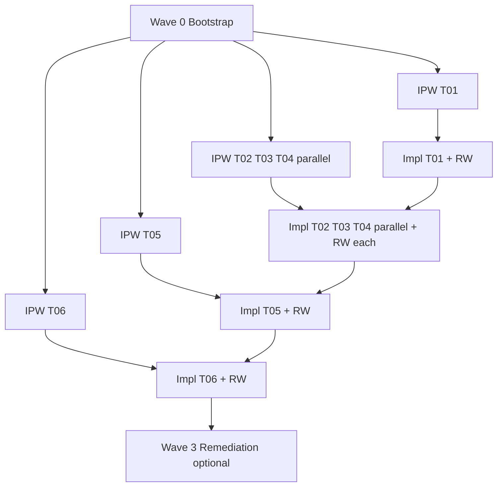

# E10:S01 — Orchestration Plan (Document Lifecycle Package Implementation Review)

**Status:** Active — coordinator SoT for all E10:S01 work  
**Host task:** [`E10:S01:T07`](../kanban/epics/epic-10/story-01-document-lifecycle-package-implementation-review/T07-coordinator-orchestration-plan-and-epic-branch-bootstrap.md) — Coordinator orchestration plan and epic branch bootstrap  
**Branch:** `epic/10-doc-lifecycle-framework`  
**Package under review:** `packages/frameworks/doc-lifecycle/`  
**Structural precedent:** E02:S13 — Workflow Management Package Implementation Review (completed)

---

## 0. Purpose (read this first)

This document is the **single coordinator source of truth** for delivering **E10:S01** end-to-end. A brand-new agent with **no prior conversation context** can:

1. Bootstrap the workspace (including a standalone clone of this branch).
2. Run **IPW** (plan mode) for each task via sub-agents.
3. Run **implementation** per linked IPP.
4. Run **`RW E10:S01:T{nn} --art`** after each task completes.
5. Optionally execute **Wave 3 remediation** filed by T06.

**Do not** infer scope from kanban templates under `packages/frameworks/kanban/templates/Epic-10/` — those are generic DB-schema placeholders. The **ai-dev-kit** E10:S01 story is a **package implementation review**, not database schema design.

---

## 1. Mission

Perform RC-readiness **implementation review** of the Document Lifecycle framework package. Produce evidence artefacts and a remediation plan to support RC sign-off for Epic 10.

### Story acceptance criteria (from story doc)

- [ ] Expectations baseline documented and approved.
- [ ] Component inventory mapped to expectations.
- [ ] Behavioral validation notes captured.
- [ ] Integration alignment reviewed and documented.
- [ ] Gap log created with severity levels.
- [ ] RC sign-off criteria and remediation tasks defined.

### Task checklist

| Task | Title | Task doc |
| ---- | ----- | -------- |
| E10:S01:T07 | **Coordinator** orchestration plan and epic branch bootstrap | [`T07-coordinator-orchestration-plan-and-epic-branch-bootstrap.md`](../kanban/epics/epic-10/story-01-document-lifecycle-package-implementation-review/T07-coordinator-orchestration-plan-and-epic-branch-bootstrap.md) |
| E10:S01:T01 | Establish expectations baseline | [`T01-establish-expectations-baseline-for-document-lifecycle-packa.md`](../kanban/epics/epic-10/story-01-document-lifecycle-package-implementation-review/T01-establish-expectations-baseline-for-document-lifecycle-packa.md) |
| E10:S01:T02 | Inventory package components and map to expectations | [`T02-inventory-package-components-and-map-to-expectations.md`](../kanban/epics/epic-10/story-01-document-lifecycle-package-implementation-review/T02-inventory-package-components-and-map-to-expectations.md) |
| E10:S01:T03 | Validate lifecycle behavior against documented guidance | [`T03-validate-lifecycle-behavior-against-documented-guidance.md`](../kanban/epics/epic-10/story-01-document-lifecycle-package-implementation-review/T03-validate-lifecycle-behavior-against-documented-guidance.md) |
| E10:S01:T04 | Review integrations and dependency alignment | [`T04-review-integrations-and-dependency-alignment.md`](../kanban/epics/epic-10/story-01-document-lifecycle-package-implementation-review/T04-review-integrations-and-dependency-alignment.md) |
| E10:S01:T05 | Create gap log and risk assessment | [`T05-create-gap-log-and-risk-assessment.md`](../kanban/epics/epic-10/story-01-document-lifecycle-package-implementation-review/T05-create-gap-log-and-risk-assessment.md) |
| E10:S01:T06 | Define RC sign-off criteria and remediation tasks | [`T06-define-rc-sign-off-criteria-and-remediation-tasks.md`](../kanban/epics/epic-10/story-01-document-lifecycle-package-implementation-review/T06-define-rc-sign-off-criteria-and-remediation-tasks.md) |

---

## 2. Workspace bootstrap (standalone repo)

### 2.1 Branch and version

| Item | Value |
| ---- | ----- |
| Git branch | `epic/10-doc-lifecycle-framework` |
| Version schema | `0.10.S.T+B` (Epic 10) |
| Story version anchor | `v0.10.1.0+0` |
| Seeded `version.py` (Wave 0) | `VERSION_EPIC=10`, `VERSION_STORY=1`, `VERSION_TASK=0`, `VERSION_BUILD=0` |

**RW branch safety:** This branch **must** be checked out before any E10 RW. Running `RW E10:S01:T01` on `dev` will **fail** (`dev_branch_epic: 2` in `rw-config.yaml`).

### 2.2 Standalone clone options

**Option A — branch-only remote (recommended for isolated work):**

```bash
git clone -b epic/10-doc-lifecycle-framework <remote-url> ai-dev-kit-e10
cd ai-dev-kit-e10
git branch --show-current   # must print: epic/10-doc-lifecycle-framework
python packages/frameworks/workflow-mgt/scripts/validation/validate_branch_context.py --strict
```

**Option B — worktree from main clone:**

```bash
cd /path/to/ai-dev-kit
git fetch origin epic/10-doc-lifecycle-framework
git worktree add ../ai-dev-kit-e10 epic/10-doc-lifecycle-framework
cd ../ai-dev-kit-e10
```

### 2.3 Cold-start agent routing

1. Read repo-root [`AGENTS.md`](https://github.com/RMS-Ltd/ai-dev-kit/blob/main/AGENTS.md) only (ADR-012).
2. State: `Track: implementation-planning, workflows — loading: this file + host story`.
3. Load this orchestration plan before any task work.
4. IPW **must** run in plan mode (`.claude/commands/ipw.md`).
5. Implementation requires: linked IPP + explicit user authorization (`implement`, `proceed`, or `RW E:S:T`).

### 2.4 Key config paths

| Config | Path |
| ------ | ---- |
| RW config | `rw-config.yaml` |
| Version file | `src/ai_dev_kit/version.py` |
| Kanban board | `docs/kanban/kboard.md` |
| Validators | `packages/frameworks/workflow-mgt/scripts/validation/` |
| IPW command | `.claude/commands/ipw.md` |
| RW command | `.claude/commands/rw.md` |

---

## 3. Package snapshot (review subject)

**Canonical package root:** `packages/frameworks/doc-lifecycle/`  
**Adopter mirror (FR-110):** `greenfield-install/packages/frameworks/doc-lifecycle/` — parity checks required in T02/T04.

### 3.1 On-disk inventory (2026-06-06)

```
packages/frameworks/doc-lifecycle/
├── README.md
├── PACKAGE_OVERVIEW.md
├── PACKAGE_PROPOSAL.md
├── IMPLEMENTATION_GUIDE.md
├── policies/
│   ├── doc-lifecycle-metadata-spec.md
│   └── doc-lifecycle-policy.md
├── integration/
│   ├── kanban-integration.md
│   └── workflow-mgt-integration.md
├── templates/
│   ├── DOCUMENT_TEMPLATE.md
│   ├── LIFECYCLE_EXAMPLES.md
│   └── POLICY_SALIENCE_TEMPLATE.md
└── docs/
    ├── policy-salience-guide.md
    └── policy-salience-agent-parser.md
```

### 3.2 Documented but NOT on disk (expect gaps in T02/T03)

From `PACKAGE_OVERVIEW.md` — marked **future**:

- `workflows/doc-housekeeping-workflow.yaml`
- `scripts/validate_lifecycle_metadata.py`
- `scripts/housekeeping_scanner.py`

### 3.3 Repo-level architecture SoT (cross-check in T04)

These live **outside** the package and may duplicate or drift from package copies:

- `docs/architecture/standards-and-adrs/doc-lifecycle-metadata-spec.md`
- `docs/architecture/standards-and-adrs/doc-lifecycle-policy.md`
- `docs/architecture/standards-and-adrs/policy-salience-schema.md`

### 3.4 Package characteristics (inform expectations baseline)

- **Type:** Pure documentation/policy package (no runtime dependencies).
- **Independence score:** 10/10 (per README).
- **Lifecycle types:** evergreen, timeboxed, transient.
- **Key behaviors (documented):** TTL expiration, reference-aware cleanup, agent-driven metadata, housekeeping (archive/delete).

---

## 4. Structural precedent — E02:S13

Mirror task structure, companion artefact naming, and IPP patterns from the **completed** workflow-mgt review:

| E10:S01 | E02:S13 precedent | Precedent companion / IPP |
| ------- | ----------------- | ------------------------- |
| T01 | T01 expectations baseline | [`T01-expectations-baseline.md`](../kanban/epics/epic-02/story-13-workflow-management-package-implementation-review/T01-expectations-baseline.md) |
| T02 | T02 component inventory | [`component-inventory-map.md`](../kanban/epics/epic-02/story-13-workflow-management-package-implementation-review/component-inventory-map.md) · [`IPP-E02S13T02`](../implementation-cycles/IPP-E02S13T02-inventory-package-components-map.md) |
| T03 | T03 behavior validation | [`workflow-behavior-validation-report.md`](../kanban/epics/epic-02/story-13-workflow-management-package-implementation-review/workflow-behavior-validation-report.md) · [`IPP-E02S13T03`](../implementation-cycles/IPP-E02S13T03-workflow-behavior-validation.md) |
| T04 | T04 integration alignment | [`integration-alignment-report.md`](../kanban/epics/epic-02/story-13-workflow-management-package-implementation-review/integration-alignment-report.md) · [`IPP-E02S13T04`](../implementation-cycles/IPP-E02S13T04-integration-dependency-alignment.md) |
| T05 | T05 gap log | [`T05-create-gap-log-and-risk-assessment.md`](../kanban/epics/epic-02/story-13-workflow-management-package-implementation-review/T05-create-gap-log-and-risk-assessment.md) · [`IPP-E02S13T05`](../implementation-cycles/IPP-E02S13T05-gap-log-risk-assessment.md) |
| T06 | T06 RC sign-off | [`T06-define-rc-sign-off-criteria-and-remediation-tasks.md`](../kanban/epics/epic-02/story-13-workflow-management-package-implementation-review/T06-define-rc-sign-off-criteria-and-remediation-tasks.md) · [`IPP-E02S13T06`](../implementation-cycles/IPP-E02S13T06-rc-sign-off-remediation.md) |

**Note:** E02:S13 had **no separate code review gate** equivalent to E07:S07:T01 for workflow-mgt. T05 for doc-lifecycle synthesizes T01–T04 only unless a future code review is filed.

---

## 5. Dependency graph and parallelism



| Phase | Parallel? | Hard dependency |
| ----- | --------- | --------------- |
| Wave 0 bootstrap | No | Before all work |
| IPW all tasks | **Yes — 6 agents** | Plan mode only; no impl |
| Impl T01 | No | Blocks T02–T04 |
| Impl T02–T04 | **Yes — 3 agents** | Requires T01 companion |
| Impl T05 | No | Requires T02–T04 companions |
| Impl T06 | No | Requires T05 gap log |
| Wave 3 remediation | Per-task | After T06 files tasks |

**RW serialization:** If parallel impl agents conflict on git, **serialize RW** on the coordinator — one `RW` at a time on the branch.

---

## 6. Wave 0 — Bootstrap (coordinator)

Execute once before IPW or implementation.

| Step | Action | Verification |
| ---- | ------ | ------------ |
| 0.1 | Confirm branch `epic/10-doc-lifecycle-framework` | `git branch --show-current` |
| 0.2 | Confirm version `0.10.1.0+0` in `src/ai_dev_kit/version.py` | Read file |
| 0.3 | Run branch safety | `python packages/frameworks/workflow-mgt/scripts/validation/validate_branch_context.py --strict` → exit 0 |
| 0.4 | Set story E10:S01 status `IN PROGRESS` in story doc | Story checklist unchanged until tasks complete |
| 0.5 | Promote kboard rows E10:S01:T01–T06 from **Could Have (C)** → **Should Have (S)** when work starts | Optional at first RW Step 7 |

---

## 7. Wave 1 — IPW (plan mode, 6 parallel sub-agents)

### 7.1 Global IPW rules

- Command: `IPW E10:S01:T{nn}` or `/ipw E10:S01:T{nn}` in **plan mode**.
- Output: `docs/implementation-cycles/IPP-E10S01T{nn}-{slug}.md` (Sections 1–7 per `.claude/commands/ipw.md`).
- Use `--skip-tests` for all tasks with justification: *"Review/doc artefact task — verification via structural checklist V1–Vn; no executable code."*
- Every IPP **must** include:
  - Step 1: `TODO → IN PROGRESS` on task doc
  - Final step: status reconciliation (`COMPLETE` / `IN PROGRESS` / `BLOCKED`)
  - RW prescription: `RW E10:S01:T{nn} --art` (never `--dpz` for follow-on waves — BR-097)
- Link IPP from task doc **Input/References** (bidirectional).

### 7.2 Planned IPP output paths

| Task | IPP filename (create) |
| ---- | --------------------- |
| T01 | `docs/implementation-cycles/IPP-E10S01T01-expectations-baseline-doc-lifecycle.md` |
| T02 | `docs/implementation-cycles/IPP-E10S01T02-component-inventory-map.md` |
| T03 | `docs/implementation-cycles/IPP-E10S01T03-lifecycle-behavior-validation.md` |
| T04 | `docs/implementation-cycles/IPP-E10S01T04-integration-dependency-alignment.md` |
| T05 | `docs/implementation-cycles/IPP-E10S01T05-gap-log-risk-assessment.md` |
| T06 | `docs/implementation-cycles/IPP-E10S01T06-rc-sign-off-remediation.md` |

### 7.3 Sub-agent prompt — IPW (copy per task)

Replace `{NN}`, `{nn}`, `{SLUG}`, `{PRECEDENT_IPP}`, `{PRECEDENT_COMPANION}`.

```
You are the IPW agent for E10:S01:T{nn} on branch epic/10-doc-lifecycle-framework.

READ FIRST (mandatory):
- docs/implementation-cycles/E10S01-orchestration-plan.md
- Host task doc under docs/kanban/epics/epic-10/story-01-document-lifecycle-package-implementation-review/
- .claude/commands/ipw.md

HOST TASK: E10:S01:T{nn}
PRECEDENT: Mirror E02:S13:T{nn} — {PRECEDENT_COMPANION}
PRECEDENT IPP: {PRECEDENT_IPP}

PACKAGE UNDER REVIEW: packages/frameworks/doc-lifecycle/
ADOPTER MIRROR: greenfield-install/packages/frameworks/doc-lifecycle/

Run full IPW in PLAN MODE. Use --skip-tests with doc/review justification.

Write IPP to: docs/implementation-cycles/IPP-E10S01T{nn}-{SLUG}.md

Stop after IPP is written and task doc references it. Do NOT implement.
```

### 7.4 Per-task IPW brief

#### T01 — Expectations baseline

- **Inputs:** Package README, PACKAGE_OVERVIEW, IMPLEMENTATION_GUIDE, policies/, integration/, templates/, docs/
- **Deliverable (impl):** Expectations baseline — inline in task doc OR companion `expectations-baseline.md` under story folder (follow S13 T01 pattern)
- **Precedent:** E02:S13:T01 (no separate IPP existed; still write IPP for consistency)
- **Out of scope:** Inventory tables (T02), gap fixes

#### T02 — Component inventory

- **Inputs:** T01 baseline, full directory walk of package + greenfield mirror
- **Deliverable (impl):** `component-inventory-map.md` in story folder
- **Precedent IPP:** IPP-E02S13T02
- **Expected gaps:** Missing scripts/, workflows/ vs PACKAGE_OVERVIEW; PACKAGE_PROPOSAL still "Proposal" status

#### T03 — Behavior validation

- **Inputs:** T01 baseline, policies, LIFECYCLE_EXAMPLES, repo sample docs with frontmatter
- **Deliverable (impl):** `lifecycle-behavior-validation-report.md`
- **Precedent IPP:** IPP-E02S13T03
- **Focus:** Metadata spec compliance, TTL rules, reference-aware cleanup (documented vs observable), agent rules in .cursorrules

#### T04 — Integration alignment

- **Inputs:** integration/*.md, kanban + workflow-mgt cross-refs, architecture ADRs vs package policies
- **Deliverable (impl):** `integration-alignment-report.md`
- **Precedent IPP:** IPP-E02S13T04
- **Focus:** RW frontmatter lifecycle, Kanban doc lifecycle, greenfield-install parity (FR-110)

#### T05 — Gap log

- **Inputs:** T01–T04 companions
- **Deliverable (impl):** Gap log in T05 task doc (S13 pattern) conforming to [`gap-log-schema.md`](../architecture/standards-and-adrs/gap-log-schema.md)
- **Gap ID prefix:** `GAP-DOCLIFE-{TYPE}-NNN` (e.g. `GAP-DOCLIFE-STRUCT-001`)
- **Validator:** `python packages/frameworks/workflow-mgt/scripts/validation/validate_gap_log.py --path <t05-doc> --strict`
- **Precedent IPP:** IPP-E02S13T05

#### T06 — RC sign-off

- **Inputs:** T05 gap log
- **Deliverable (impl):** RC criteria C1–C6, sign-off posture, remediation backlog
- **Precedent IPP:** IPP-E02S13T06
- **Expected posture:** Likely **DEFER** if HIGH gaps exist (missing scripts/workflows)
- **Action:** File remediation tasks/FRs for HIGH gaps with bidirectional links

### 7.5 IPW completion gate

Before implementation, coordinator verifies:

- [ ] Six IPP files exist at paths in §7.2
- [ ] Each task doc links to its IPP
- [ ] User authorized implementation (`implement` / `proceed with implementation`)

---

## 8. Wave 2 — Implementation + RW

### 8.1 Global implementation rules

- Follow linked IPP step order exactly.
- **Commits only via RW** — never manual `git commit`.
- After each task: `RW E10:S01:T{nn} --art` (local-complete; add `--push` only if operator requests).
- RW mandatory gates: Step 1 branch safety → 1b task token → 1c task complete → 1d intent guard.
- Step 7 four-surface kanban: task doc, story checklist, kboard row, FR/BR if applicable.

### 8.2 Expected version progression

| After RW | Internal version | Task |
| -------- | ---------------- | ---- |
| T07 | `v0.10.1.7+1` | Coordinator bootstrap (Wave 0) |
| T01 | `v0.10.1.1+1` | Expectations baseline |
| T02 | `v0.10.1.2+1` | Component inventory |
| T03 | `v0.10.1.3+1` | Behavior validation |
| T04 | `v0.10.1.4+1` | Integration alignment |
| T05 | `v0.10.1.5+1` | Gap log |
| T06 | `v0.10.1.6+1` | RC sign-off |

Same-task follow-on releases increment BUILD: `+2`, `+3`, … (BR-097).

### 8.3 Sub-agent prompt — Implementation (copy per task)

```
You are the implementation agent for E10:S01:T{nn} on branch epic/10-doc-lifecycle-framework.

READ FIRST (mandatory):
- docs/implementation-cycles/E10S01-orchestration-plan.md
- docs/implementation-cycles/IPP-E10S01T{nn}-*.md (linked IPP)
- Host task doc

Execute the IPP implementation plan in order:
1. Transition task TODO → IN PROGRESS
2. Create/update deliverables per IPP §4
3. Flesh out task doc Scope, AC, Input, References
4. Run verification checklist from IPP §3
5. Run RW E10:S01:T{nn} --art (full 12 steps, .claude/commands/rw.md)
6. Reconcile task status to COMPLETE with forensic marker if ACs met

Do NOT push unless --push is in the RW trigger.
Serialize with other agents if git conflicts occur — coordinator owns merge/RW ordering.
```

### 8.4 Wave 2A — T01 (sequential gate)

**Blocks:** T02, T03, T04 implementation.

**Companion artefact options:**

- `docs/kanban/epics/epic-10/story-01-document-lifecycle-package-implementation-review/expectations-baseline.md` (recommended), OR
- Full baseline inline in T01 task doc (S13 used inline sections in task doc)

**Minimum acceptance criteria (coordinator):**

- [ ] Core operating principles captured
- [ ] Expected lifecycle behaviors documented
- [ ] Integration expectations mapped
- [ ] Package composition documented
- [ ] Source references cited
- [ ] Task doc Scope/AC/Input complete
- [ ] RW complete → `v0.10.1.1+1`

### 8.5 Wave 2B — T02 ∥ T03 ∥ T04 (parallel)

Launch three implementation sub-agents after T01 RW completes.

| Task | Companion file |
| ---- | -------------- |
| T02 | `story-01-.../component-inventory-map.md` |
| T03 | `story-01-.../lifecycle-behavior-validation-report.md` |
| T04 | `story-01-.../integration-alignment-report.md` |

Each agent runs its own RW when done. If git conflicts: merge on coordinator, then RW one at a time.

### 8.6 Wave 2C — T05 (sequential)

- Consolidate T01–T04 into gap log per [`gap-log-schema.md`](../architecture/standards-and-adrs/gap-log-schema.md)
- Run `validate_gap_log.py --strict`
- RW → `v0.10.1.5+1`

### 8.7 Wave 2D — T06 (sequential)

- Define RC criteria C1–C6 with evidence links
- Document sign-off posture (PASS / CONDITIONAL / DEFER)
- Remediation backlog for all `GAP-DOCLIFE-*` IDs
- **File kanban tasks** for HIGH-severity gaps (pattern: E02:S13:T09, T10)
- RW → `v0.10.1.6+1`
- Update story checklist: all T01–T06 COMPLETE

---

## 9. Wave 3 — Remediation (contingent)

Triggered by T06 remediation backlog. **Not part of E10:S01 story closure** but required for RC PASS.

### 9.1 Likely remediation themes (anticipatory — confirm from T05/T06)

| Theme | Example work | Suggested task home |
| ----- | ------------ | ------------------- |
| Missing validators | Implement `validate_lifecycle_metadata.py` | New E10:S01:T07+ or Epic 10 story 2 |
| Missing housekeeping workflow | Add `doc-housekeeping-workflow.yaml` | Same |
| ADR ↔ package policy drift | Sync pass + cross-links | E10:S02 or maintenance |
| greenfield-install parity | FR-110 parity fixes | E10:S02 installation eval |
| Repo frontmatter compliance | Batch metadata fixes | Perpetual doc maintenance |

### 9.2 Remediation agent loop (per filed task)

1. `IPW E10:Sxx:Txx` (plan mode) → IPP
2. User authorizes implementation
3. Implement per IPP
4. `RW E10:Sxx:Txx --art`
5. Repeat for multi-wave IPPs (§8 rolling backlog)

---

## 10. Deliverable housing map

**Story artefact directory:**  
`docs/kanban/epics/epic-10/story-01-document-lifecycle-package-implementation-review/`

| Task | Companion artefact(s) | IPP |
| ---- | --------------------- | --- |
| T07 | Orchestration plan + this task doc (triage) | —No IPP— (coordinator meta-task) |
| T01 | `expectations-baseline.md` (recommended) | `IPP-E10S01T01-*.md` |
| T02 | `component-inventory-map.md` | `IPP-E10S01T02-*.md` |
| T03 | `lifecycle-behavior-validation-report.md` | `IPP-E10S01T03-*.md` |
| T04 | `integration-alignment-report.md` | `IPP-E10S01T04-*.md` |
| T05 | Gap log (task doc body per S13) | `IPP-E10S01T05-*.md` |
| T06 | RC checklist + remediation matrix (task doc) | `IPP-E10S01T06-*.md` |

**Orchestration SoT:** `docs/implementation-cycles/E10S01-orchestration-plan.md` (this file)

---

## 11. Coordinator checklist (master)

| # | Gate | Status |
| - | ---- | ------ |
| 1 | Branch `epic/10-doc-lifecycle-framework` exists | ✅ Created 2026-06-06 |
| 2 | Version seeded `0.10.1.0+0` | ✅ See version.py |
| 3 | Orchestration plan committed on branch | ☐ Operator push to standalone repo |
| 3b | T07 task filed with triage/bootstrap | ✅ 2026-06-06 |
| 4 | T07 RW `v0.10.1.7+1` | ✅ |
| 5 | Six IPPs written (Wave 1) | ✅ v0.10.1.7+2 |
| 6 | User authorized implementation | ✅ PM coordinator |
| 7 | T01 RW `v0.10.1.1+1` | ✅ |
| 8 | T02–T04 RWs complete | ✅ |
| 9 | T05 RW + validate_gap_log strict | ✅ |
| 10 | T06 RW + remediation tasks filed | ✅ |
| 11 | Story E10:S01 all tasks COMPLETE | ✅ @ v0.10.1.10+1 (UKW sign-off 2026-06-06) |
| 12 | Handoff to E10:S02 (installation evaluation) | ☐ |

---

## 12. RW quick reference (per task)

```bash
# Mandatory pre-check
python packages/frameworks/workflow-mgt/scripts/validation/validate_branch_context.py --strict

# Wave 0 release (bootstrap)
RW E10:S01:T07 --art

# Review tasks (repeat per task)
RW E10:S01:T01 --art
RW E10:S01:T02 --art
RW E10:S01:T03 --art
RW E10:S01:T04 --art
RW E10:S01:T05 --art
RW E10:S01:T06 --art
```

**Forbidden:** `git commit` outside RW; `git tag -f`; `--dpz` on follow-on verification waves (BR-097).

---

## 13. Known risks

| Risk | Mitigation |
| ---- | ---------- |
| Task docs are FR-016 stubs (empty Scope/AC) | T01 IPP/impl fleshes all six task docs |
| Parallel RW git conflicts | Serialize RW on coordinator |
| Package is docs-only — no runtime "behavior" | T03 validates policy compliance + repo frontmatter samples |
| Architecture ADRs duplicate package policies | T04 maps both trees explicitly |
| kboard lists Epic 10 as COMPLETE in header note but tasks are TODO | Fix in first E10 RW Step 7 |
| No E07 code review for doc-lifecycle | T05 uses T01–T04 only; file code review FR if needed in Wave 3 |

---

## 14. Related documents

| Doc | Path |
| --- | ---- |
| Epic 10 | `docs/kanban/epics/epic-10/Epic-10.md` |
| Story E10:S01 | `docs/kanban/epics/epic-10/story-01-document-lifecycle-package-implementation-review.md` |
| Story E10:S02 (next) | `docs/kanban/epics/epic-10/story-02-document-lifecycle-package-installation-evaluation.md` |
| Gap log schema | `docs/architecture/standards-and-adrs/gap-log-schema.md` |
| IPW vs IPP policy | `docs/governance/standards/dev-kit-ipw-ipp-vs-icw-artifacts.md` |
| Workflow cheatsheet | `docs/guides/workflow-initiation-cheatsheet.md` |

---

## 15. Revision history

| Date | Change |
| ---- | ------ |
| 2026-06-06 | Initial orchestration plan; branch `epic/10-doc-lifecycle-framework` created; version seeded |
| 2026-06-06 | E10:S01:T07 filed — host task for coordinator bootstrap and triage |
| 2026-06-06 | E10:S01 story sign-off — all tasks COMPLETE @ v0.10.1.10+1; RC **APPROVE**; handoff gate → S02 |
