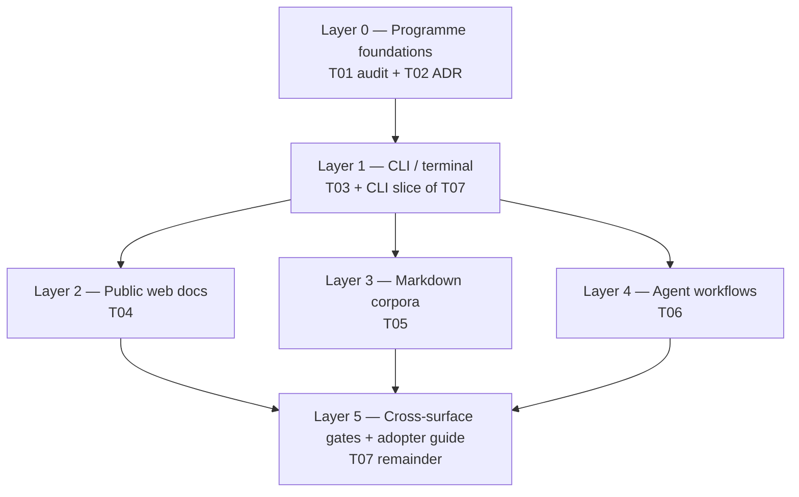

# E21:S08:T01 — Planning: Layered accessibility programme (CLI-first) (IPW)

**Host Task:** [`T01-accessibility-baseline-audit-and-standards-mapping.md`](../project-management/kanban/epics/epic-21/story-08-accessibility/T01-accessibility-baseline-audit-and-standards-mapping.md) **(E21:S08:T01)**  
**Planning for:** [FR-115](../project-management/kanban/fr-br/FR-115-accessibility-standards-compatibility.md) · [Story 08](../project-management/kanban/epics/epic-21/story-08-accessibility.md)  
**Status:** Complete — T01 audit released `v0.21.8.1+1` (`RW -k E21:S08:T01 --art`)  
**Branch:** `epic/21-internationalisation-localisation`

---

## 1. Requirements (Ascertained Baseline)

### 1.1 Functional requirements

| ID | Requirement | Source |
| -- | ----------- | ------ |
| RF1 | Deliver accessibility in **layers**; each layer ships independently via RW | User direction; FR-115 |
| RF2 | **Layer 1 (initial scope)** = CLI / terminal only (`ai-dev-kit`, shared installer output) | User direction |
| RF3 | T01 audit **executes deeply on Layer 1**; catalogues Layers 2–5 at summary level only | RF1 |
| RF4 | T02 ADR defines layer model, conformance targets per layer, and Layer 1 exit criteria | FR-115 |
| RF5 | Layer 1 remediation in T03; no Layer 2+ implementation until Layer 1 COMPLETE | RF1 |
| RF6 | Align CLI errors with [FR-108](../project-management/kanban/fr-br/FR-108-install-setup-error-code-registry-and-emission.md) plain-language patterns | FR-108 |
| RF7 | IPP ↔ task doc wiring; story checklist updated | IPW Phase 8 |

### 1.2 Non-functional requirements

| ID | Requirement |
| -- | ----------- |
| RNF1 | Do not block E21:S02 i18n delivery (parallel tracks) |
| RNF2 | Backward-compatible CLI output unless `--no-color` / `NO_COLOR` or major-version policy |
| RNF3 | Stdlib-first; no new heavy TUI dependencies for Layer 1 |
| RNF4 | Tests for Layer 1 patterns (`pytest` on output helpers) |

### 1.3 Out of scope (Layer 1)

- Docusaurus portal (Layer 2 / T04)
- Markdown/kanban corpora (Layer 3 / T05)
- Agent workflow prose (Layer 4 / T06)
- Cross-surface CI gates (Layer 5 / T07) — Layer 1 may add CLI-only lint/tests only

---

## 2. Layer model

| Layer | Tasks | Surface | Standards lens | Ship gate |
| ----- | ----- | ------- | -------------- | --------- |
| **0** | T01, T02 | Programme | Map CLI to EN 301 549 / Section 508 software criteria; WCAG principles by analogy for terminal | ADR accepted |
| **1** | T03, T07 (CLI guide only) | `cli/`, `ai-dev-kit` entrypoints, installer scripts sharing `print_*` | No colour-only status; text prefixes; `NO_COLOR`; structured errors | Layer 1 AC + tests green |
| **2** | T04 | Docusaurus public site | WCAG 2.2 AA (web) | Deferred |
| **3** | T05 | `docs/`, kanban markdown | Authoring conventions | Deferred |
| **4** | T06 | RW/UKW/IPW agent outputs | Plain-text blocking states | Deferred |
| **5** | T07 (remainder) | CI + adopter docs | Automated + manual gates | Deferred |

**Initial execution boundary:** Layers **0 + 1** only. Layers 2–5 remain filed on the board but are **explicitly deferred** until Layer 1 COMPLETE.

---

## 3. Specification — Layer 1 (CLI / terminal)

**Canonical spec (to be published in T02/T03):** `docs/governance/standards/cli-accessibility-conventions.md` (CREATE in T03)

### 3.1 CLI surface inventory (audit scope)

| Area | Path / entry | Notes |
| ---- | ------------- | ----- |
| Output helpers | `cli/utils.py` — `print_error`, `print_success`, `print_warning`, `print_info` | Emoji prefixes today (❌ ✅ ⚠️ ℹ️) |
| Commands | `cli/commands/` — `init`, `install`, `config`, `check`, `logs` | Interactive prompts + flags |
| Errors | `cli/exceptions.py`, `cli/adk_install_errors_bridge.py` | FR-108 structured codes |
| Localisation | `cli/localisation.py`, `cli/commands/config.py` | Locale prompts; must stay a11y-safe |
| Installers | `packages/frameworks/workflow-mgt/scripts/install_release_workflow.py` (shared patterns) | Coordinate; not full Layer 1 unless output helpers shared |

### 3.2 Layer 1 gap themes (baseline hypotheses — T01 validates)

| Theme | Current risk | Target pattern |
| ----- | ------------ | -------------- |
| **Colour / icon-only status** | Emoji conveys severity without redundant text | Text label first: `Error:`, `Success:`, `Warning:`, `Info:`; emoji optional when colour enabled |
| **NO_COLOR** | Not honoured in `print_*` | Respect `NO_COLOR` env (and `--no-color` on root parser if added) — strip emoji, avoid ANSI |
| **Screen readers** | Mixed stderr/stdout for errors | Errors → stderr with consistent prefix; success may stay stdout |
| **Cognitive load** | Long unstructured tracebacks | FR-108 code + one-line summary + optional `--debug` traceback |
| **Interactive prompts** | Locale/init wizards | Numbered options, default stated in text, `--non-interactive` documented |
| **i18n interaction** | Locale strings may lengthen prompts | Layer 1 tests include en-GB and en-US; do not regress FR-006 |

### 3.3 Layer 1 acceptance criteria (T03)

- [ ] `print_*` helpers emit redundant text labels (not emoji-only)
- [ ] `NO_COLOR` suppresses emoji/ANSI in CLI output
- [ ] Install/init errors follow FR-108 shape without colour-only signalling
- [ ] `pytest` module `tests/test_cli_accessibility.py` (or extend `test_commands.py`) covers output patterns
- [ ] CLI accessibility conventions doc published and linked from user docs

### 3.5 ADR necessity (T02)

**Outcome:** **CREATE** — `ADR-0XX-adk-layered-accessibility-strategy.md` (number assigned at T02). Layer model and per-layer conformance are architectural; CLI conventions are governance standard (§3).

---

## 4. Test design (Layer 1)

| ID | Behaviour | Module |
| -- | --------- | ------ |
| A1 | `print_error` includes `Error:` text with `NO_COLOR=1` | `tests/test_cli_accessibility.py` |
| A2 | `print_success` includes success text label without emoji when `NO_COLOR=1` | same |
| A3 | FR-108 error emission includes code + message (no emoji-only) | `tests/test_commands.py` or install error tests |
| A4 | `adk init --non-interactive` avoids interactive-only failure modes | existing + extend |
| A5 | Locale prompt text readable (no status-only glyph) | `tests/test_fr006_*` coordination |

T01 audit deliverable is **doc-only** — tests land in T03.

---

## 5. T01 deliverable (Layer 0 — CLI-focused audit)

**Path:** `docs/knowledge/analysis/adk-accessibility-baseline-layer1-cli.md`

**Contents:**

1. Layer model summary (this IPP §2)
2. CLI command inventory table
3. Gap list with severity (blocker / major / minor)
4. Mapping to EN 301 549 / Section 508 software clauses + WCAG analogues
5. Layer 2–5 **catalogue only** (one paragraph per layer, no deep audit)
6. Recommended Layer 1 exit criteria → feeds T02 ADR

---

## 6. Implementation plan

| Step | Action | Layer |
| ---- | ------ | ----- |
| **1** | E21:S08:T01 `TODO → IN PROGRESS` | 0 |
| 2 | `RW -k E21:S08:T01 --art --dpz` — version intake docs | 0 |
| 3 | Publish Layer 1 CLI baseline report (§5) | 0 |
| 4 | T01 → COMPLETE; T02 `TODO → IN PROGRESS` | 0 |
| 5 | T02: ADR layered strategy + Layer 1 conformance matrix | 0 |
| 6 | T03: Implement CLI conventions + tests | 1 |
| 7 | T07 (partial): CLI adopter subsection in user docs | 1 |
| 8 | `RW E21:S08:T03 --art` — Layer 1 ship | 1 |
| **N** | Reconcile T01/T02/T03 status to actual state | — |

**Explicit deferrals:** T04, T05, T06, T07 (cross-surface) — no IPW, no implementation until Layer 1 COMPLETE and user re-prioritises.

---

## 7. Documentation deliverables

| Action | Path | Task |
| ------ | ---- | ---- |
| CREATE | `docs/knowledge/analysis/adk-accessibility-baseline-layer1-cli.md` | T01 |
| CREATE | `docs/architecture/standards-and-adrs/ADR-0XX-adk-layered-accessibility-strategy.md` | T02 |
| CREATE | `docs/governance/standards/cli-accessibility-conventions.md` | T03 |
| UPDATE | `docs/documentation/user-docs/framework-dependency-cli-reference.md` — a11y section | T03 |
| UPDATE | Story + FR-115 — layer model | T01 |

---

## 8. Success criteria

- [x] Layer model documented and linked from story, FR-115, T01
- [x] T01 audit covers CLI deeply; Layers 2–5 catalogue-only
- [x] T02 ADR defines Layer 1 exit criteria before T03 starts — ADR-025 @ v0.21.8.2+1
- [ ] Layer 1 implementation (T03) not started until T01 + T02 COMPLETE

---

## References

- [FR-115](../project-management/kanban/fr-br/FR-115-accessibility-standards-compatibility.md)
- [FR-108](../project-management/kanban/fr-br/FR-108-install-setup-error-code-registry-and-emission.md)
- [cli/utils.py](../../cli/utils.py)
- [EN 301 549](https://www.etsi.org/standard/EN-301-549) — ICT accessibility (software)
